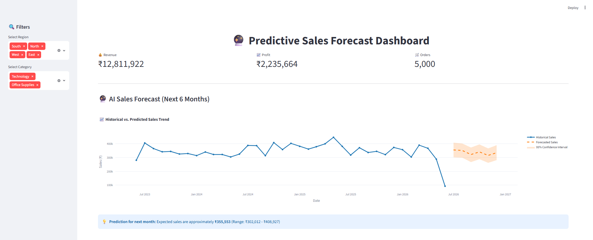
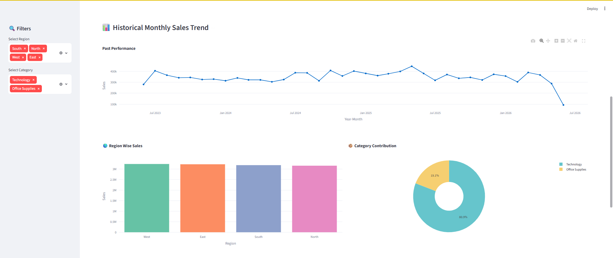
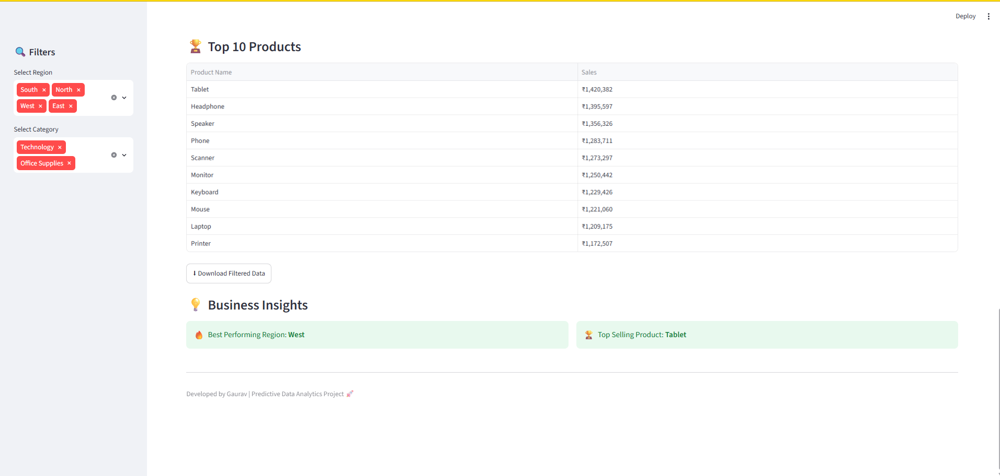

# 📈 Predictive Sales Forecast Dashboard

## Project Overview

Predictive Sales Forecast Dashboard is a Python-based Data Analytics and Machine Learning project developed during my Data Analytics Internship at CodeTech IT Solutions. The project analyzes historical sales data, visualizes business trends, and predicts future sales using machine learning. An interactive dashboard helps transform raw data into clear insights, supporting better business decisions and sales planning. 📊🚀

---

## 🎯 Project Objective

This project aims to analyze historical sales data and predict future sales trends using machine learning. The interactive dashboard helps businesses monitor performance, track key metrics, identify trends, and make informed decisions through data-driven insights.

---

## 🚀 Technologies Used

The project leverages **Python** for data analysis, machine learning, and dashboard development. Key libraries and tools used include **Pandas** and **NumPy** for data processing, **Plotly** for interactive visualizations, **Prophet** for sales forecasting, **Streamlit** for dashboard deployment, **Jupyter Notebook** for development, and **GitHub** for version control and project management.

---

## 📂 Dataset Information

The project uses a sales dataset containing:

* Order Date
* Sales
* Profit
* Region
* Category
* Product Name
* Quantity

The dataset is used to perform sales analysis and future sales forecasting.

---
## ⚙️ Project Development Process

### Step 1: Data Collection
Imported the sales dataset using **Pandas** and explored its structure for analysis.

### Step 2: Data Cleaning & Preprocessing
Prepared the dataset by **converting date columns**, creating **Year and Month features**, formatting data, and validating records.

### Step 3: Sales Analysis
Performed detailed analysis to identify **historical sales trends**, **revenue patterns**, **profit performance**, **regional performance**, **category contribution**, and **top-selling products**.

### Step 4: Dashboard Development
Built an interactive dashboard using **Streamlit** and **Plotly** with features such as **KPI Cards**, **Interactive Filters**, **Sales Trend Charts**, **Region-wise Analysis**, **Category-wise Analysis**, **Top Products Analysis**, and **Data Download Functionality**.

### Step 5: Sales Forecasting
Implemented the **Prophet Machine Learning Model** to forecast future sales trends, including **6-Month Sales Prediction**, **Historical Trend Learning**, and **Confidence Interval Visualization**.

### Step 6: Business Insights
Generated actionable insights such as **Best Performing Regions**, **Top Selling Products**, **Sales Growth Trends**, and **Future Sales Expectations**.

### Step 7: Deployment
Successfully deployed the dashboard on **Streamlit Cloud** and integrated it with **GitHub** for version control, continuous updates, and project maintenance.

---

## ✨ Key Features

* Data Cleaning and Preprocessing
* KPI Analysis
* Historical Sales Trend Analysis
* Region-wise Sales Analysis
* Category-wise Sales Analysis
* Top Products Analysis
* AI-Based Sales Forecasting
* 6-Month Sales Prediction
* Interactive Dashboard
* Business Insights Generation
* Download Filtered Data Functionality
* Live Web Deployment

---

## 🌐 Live Deployment

One of the most important parts of this project was deploying the dashboard as a live web application using **Streamlit Cloud**.

The dashboard is now available online and can be accessed directly through a web browser without installing any software.

### 🔗 Live Dashboard

👉 https://gauravdataai-predictive-sal-predictive-sales-forecastapp-itlpmt.streamlit.app/

### 📋 Deployment Details

- **Platform:** Streamlit Cloud
- **Repository:** GitHub
- **Deployment Type:** Public Web Application
- **Status:** 🟢 Live & Active

### 🚀 What I Learned

During this deployment, I learned:

- **How to deploy a Streamlit dashboard**
- **How to connect GitHub with Streamlit Cloud**
- **How to manage project files and requirements**
- **How to fix deployment errors**
- **How to update a live project using GitHub**

### ⭐ Why This Is Important

This deployment helped me understand how to take a project from my local computer to a live website. The skills learned in this project will help me build and deploy future Data Analytics, Data Science, and Machine Learning projects more easily.

## 🔗 Project Links

🌐 [View Live Dashboard](https://gauravdataai-predictive-sal-predictive-sales-forecastapp-itlpmt.streamlit.app/)

📘 [View Jupyter Notebook](https://github.com/GauravDataAI/Predictive-Sales-Forecast/blob/main/Predictive-Sales-Forecast/Predictive_Sales_Forecast.ipynb)

📂 [View GitHub Repository](https://github.com/GauravDataAI/Predictive-Sales-Forecast)

---

## 📚 What I Learned

Through this project, I gained practical experience in:

* Data Analytics
* Data Visualization
* Machine Learning Forecasting
* Dashboard Development
* Business Intelligence
* Streamlit Cloud Deployment
* GitHub Project Management
* End-to-End Project Development

---

## 🔮 Future Enhancements

Future improvements for this project include:

- Advanced Forecasting Models
- Real-Time Data Integration
- Customer Analytics
- Power BI Integration
- Cloud Database Connectivity
---

## 🎓 Project Type

Data Analytics Internship Project (Project 3)

---

## 📌 Project Information

**Prepared By:** Gaurav Kevat

**Intern ID:** CITS34-46

**Course:** B.Tech (Lateral Entry) – CSE (Data Science)

**University:** Jaypee University of Engineering and Technology (JUET), Guna

**Internship Organization:** CodeTech IT Solutions

**Internship Domain:** Data Analytics

**Project Name:** Predictive Sales Forecast Dashboard

**Year:** 2026

---

## ⭐ About This Project

This project is my third Data Analytics Internship project and showcases the practical use of Data Analytics, Machine Learning, and Business Intelligence.

The dashboard analyzes historical sales data, forecasts future sales trends, and provides useful business insights through interactive visualizations. It helps businesses make smarter and data-driven decisions.

---

## ✅ Conclusion

Predictive Sales Forecast Dashboard is an end-to-end Data Analytics and Machine Learning project that combines sales analysis, forecasting, dashboard development, and live deployment.

The project demonstrates how historical sales data can be analyzed to identify trends, predict future sales, and generate meaningful business insights through interactive visualizations. It showcases practical skills in data analytics, machine learning, and dashboard development.

## 📊 Dashboard Preview

### Main Dashboard

### Sales Trend Analysis

### Top Products Analysis

